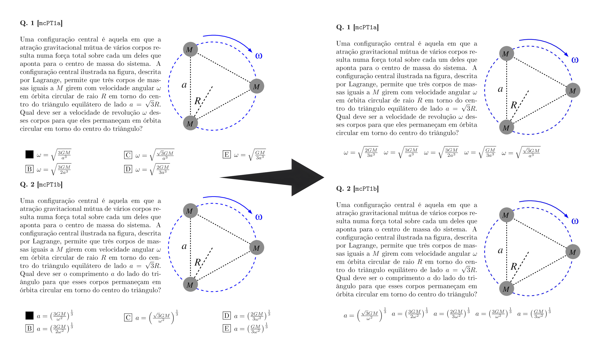

# EUF Exam Randomizer

A work‑in‑progress Python tool to transform past EUF solution manuals into fresh practice exams by stripping out the pre‑selected answers and shuffling the choices.

  

---

## 📋 What It Is

Physicists in Brazil must pass the EUF exam to enter master’s and doctoral programs. Previous years’ tests are only available as “solutions” PDFs, with the correct choice always marked first. This project automates:

1. **Extraction** of questions and answer options from a solutions manual PDF  
2. **Removal** of the pre‑selected answer  
3. **Randomization** of all answer options  
4. **Reconstruction** of a new PDF that looks and feels like an actual EUF exam  

---

## 🛠️ To-Do

- [x] Working on every test up to 2024
- [ ] Integrate NN for individual question extraction
- [ ] Improve PDF reconstruction for new page layouts
- [ ] Re-add question items 

---

## 🚀 Getting Started
Since this is still a work-in-progress project, usability improvements will come. For more information on how to generate new randomized tests, please contact me via this page or [LinkedIn](https://www.linkedin.com/in/guilherme-ataliba/). 

---

## 🤝 Contributing

Contributions and suggestions are welcome! Please open an issue or submit a pull request.

## 👨‍💻 Author
Developed by Luiz Guilherme Ataliba dos Reis, Master’s student in Computational Physics, with a focus on machine learning, symbolic regression, and high-performance computing. 
For more information, visit [LinkedIn](https://www.linkedin.com/in/guilherme-ataliba/) or follow updates

